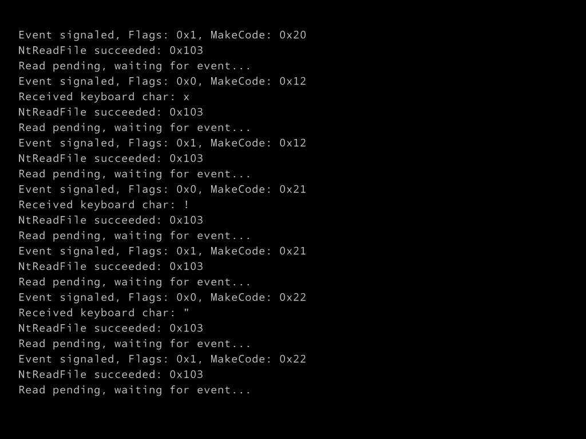

# NativeEXE 1

*Under Dev*

Windows as DOS (Style)

No more `win32k.sys``csrss.exe`

JUST `ntoskrnl.exe` (and necessary drv)

`ntdll.dll` is all you need

# Features

- Open `\Device\KeyboardClass0` for keyboard input
- Read keyboard input

# Todo

- Deal with Keyboard Scancodes
- Make a mini-shell
- Filesystem support

# Bugs

~~### `\Device\KeyboardClass0` Open failed~~

~~### read char failed~~

See [research.md](research.md) for details.