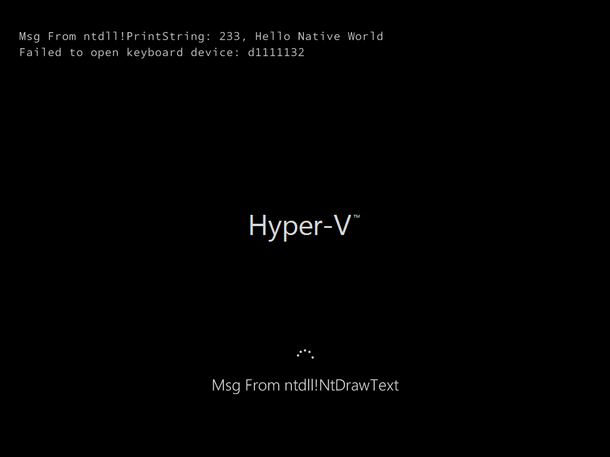

# NativeEXE 1

*Under Dev*

Windows as DOS (Style)

No more `win32k.sys``csrss.exe`

JUST `ntoskrnl.exe` (and necessary drv)

`ntdll.dll` is all you need

# Bugs

### `\Device\KeyboardClass0` Open failed



```
kd> !object \Device\KeyboardClass0
Object: ffff80061d5c7420  Type: (ffff80061c9bed20) Device
    ObjectHeader: ffff80061d5c73f0 (new version)
    HandleCount: 0  PointerCount: 3
    Directory Object: ffff910f1d62e490  Name: KeyboardClass0
```