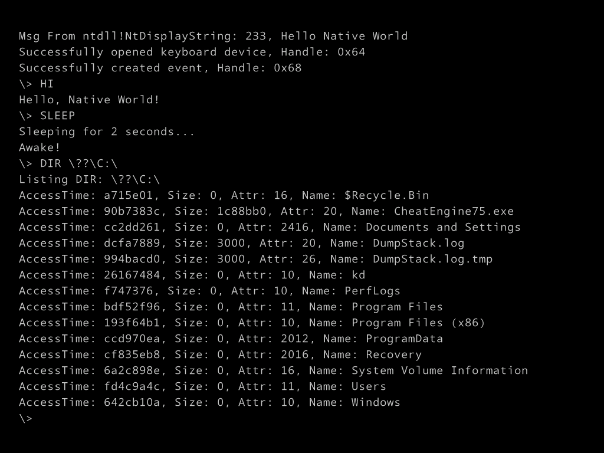

# NativeEXE 1

*Under Dev*

Windows as DOS (Style)

No more fucking `win32k.sys` or `csrss.exe`

JUST `ntoskrnl.exe` (and necessary drv)

`ntdll.dll` is all you need

# Features

- Open `\Device\KeyboardClass0` for keyboard input
- Read keyboard input
- mini-shell command support:
    - `HI`
    - `SLEEP`
    - `DIR \??\C:\`
    - `LSDEV \Device\`
    - `RUN \??\C:\xxx.exe`
    - `EXIT`
    - `INT 3`

# Todo

- [x] Deal with Keyboard Scancodes
- [x] Make a mini-shell
- [x] Filesystem support
- [x] Create Process support
- [ ] STDIO redirection

# Now Achieved

See [Gallery](./screenshot) for more screenshots.

See [research.md](research.md) for how I debugged this.

# Bugs

~~### `\Device\KeyboardClass0` Open failed~~

~~### read char failed~~