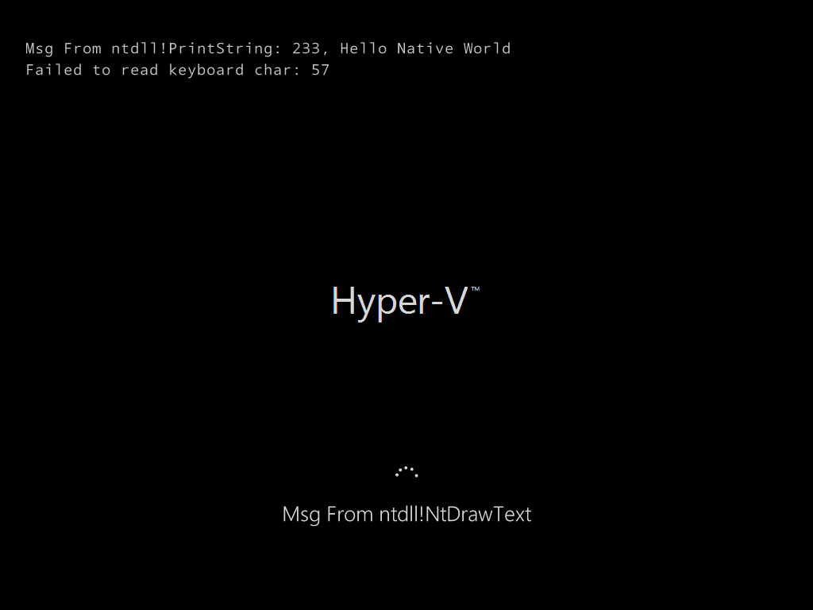

# NativeEXE 1

*Under Dev*

Windows as DOS (Style)

No more `win32k.sys``csrss.exe`

JUST `ntoskrnl.exe` (and necessary drv)

`ntdll.dll` is all you need

# Bugs

~~### `\Device\KeyboardClass0` Open failed~~

### read char failed

See [research.md](research.md) for details.